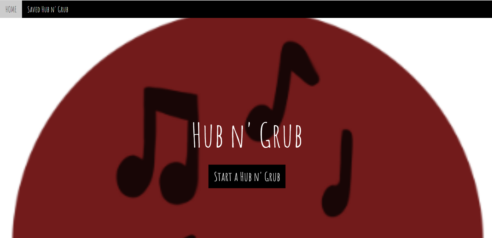

# Hub n'Grub

Javascript is used by programmers across the world to create dynamic and interactive web content like applications and browsers. JavaScript is so popular that it's the most used programming language in the world, used as a client-side programming language by 97.0% of all websites

This app allows users to experience an at home date event based off their choice of food and music. The user can input certain parameters including nutrition, serving size, time to cook, recipe steps and finally ingredients. After the parameters have been chosen the user will be prompted with a recipes that fit the criteria. Once, the meal has been selected the user will be prompted to select their choice of music to set the mood for the meal time.

The Webpage can easily access through this link[https://mkelly3.github.io/HubnGrub/]

# Table of Content

1. [HomePage](#homepage)
2. [Features](#features)
3. [CodeSnippet](#codesnippet)
4. [Tools](#tools)
5. [Prerequisites](#prerequisites)
6. [AuthorLinks](#authorlinks)

# HomePage



# Features

- User can search recipe of food
- User can search playlist
- User can save their playlist and food recipe

# CodeSnippet

```Search for food api
function getRecipes(ingrident1,ingrident2){
      console.log(ingrident1,ingrident2);
      fetch('https://api.spoonacular.com/recipes/findByIngredients?apiKey=929b3b7b8bef46ec82a39bfd9c299472&ingredients='+ingrident1+',+'+ingrident2)
      .then(function (response) {
            return response.json();
            })
            .then(function (response) {
            console.log(response);
            var titleRecipe = [];
           for(var i=0; i<8; i++){
            titleRecipe[i] = response[i].title;
           }
           titleRecipe =titleRecipe. filter(item => item);
           for (i = 0; i < titleRecipe.length; i++) {
            $('#recipeName'+i).text(titleRecipe[i]);
           }
           var recipeImg = [];
           for(var i=0; i<8; i++){
            recipeImg[i] = response[i].image;
           }
          recipeImg =recipeImg. filter(item => item);
           for (i = 0; i < recipeImg.length; i++) {
            $('#recipeImg'+i).attr({ "src": recipeImg[i], "alt": "Food Pic" });
           }
            });
}

var musicResultEl = document.querySelector('.musicDisplay');
var songTitleEl = document.querySelector("#artist");

```

```search for an artist based on genre
function getMusic(music){

      fetch("https://itunes.apple.com/search?entity=song&attribute=genreIndex&term="+music+"&limit=25")
      .then(function (response) {
            return response.json();
        })
      .then(function (response) {
            console.log(response);
            var musicDiv = document.createElement('div');
            var artistTitle = document.createElement('h3');
            var song = document.createElement('p');
            var songUrl= document.createElement('a');

            var link = document.createTextNode("This is link");
            songUrl.append(link);
            songUrl.title = "This is Link";

            var artists = [];
            for(var i=0; i<8; i++){
                  artists[i] = response.results[i].artistName;
            }
            for(var i=0; i < artists.length; i++) {
              $("#artistName" + i).text(artists[i])
            }

            var songTitle = [];
            for(var i=0; i<8; i++){
                   songTitle[i] = response.results[i].trackName;
             }
             for(var i=0; i < songTitle.length; i++) {
                 $("#songTitle" + i).text(songTitle[i])
               }

             console.log(songTitle);

            console.log(song);
            var songLink = [];
            for(var i=0; i<8; i++){
                  songLink[i] = response.results[i].trackViewUrl;
            }
            for(var i=0; i < songLink.length; i++) {
              $("#songLink" + i).attr("href", songLink[i])
            }

            for(var i=0; i<songLink;i++){
                  songUrl.href = songLink
            }


            console.log(songLink);
            musicDiv.appendChild(songUrl);
            musicDiv.appendChild(artistTitle);
            musicDiv.appendChild(song);
            musicResultEl.appendChild(musicDiv);
            musicResultEl.removeAttribute("data-style");
      })
      .catch(err => console.error(err));
}

```

# Tools

1. VsCode
2. Git (windows)
3. Github
4. Jquery
5. W3 CSS
6. JAVASCRIPT

# Prerequisites

Software need to be install

- Vscode
- git
- github(clone project)

# AuthorLinks

[Github](https://github.com/mkelly3/HubnGrub)
